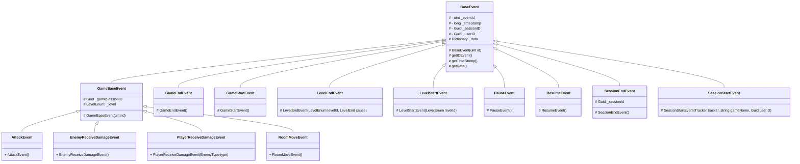
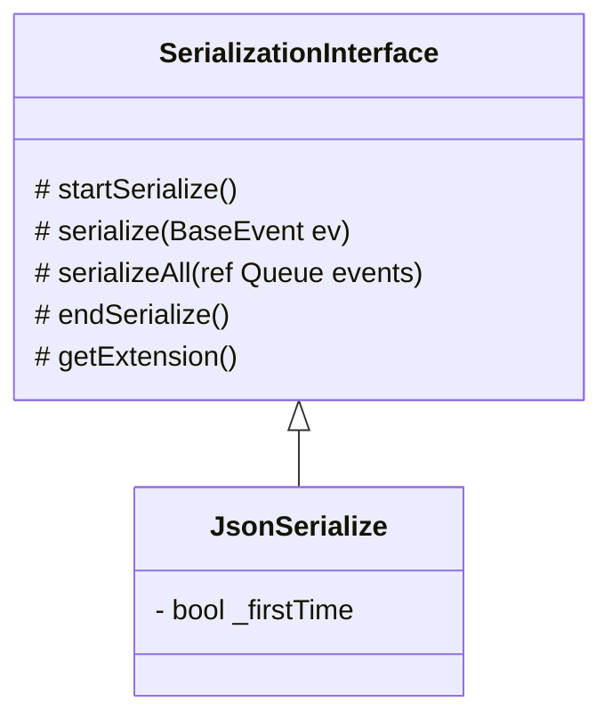
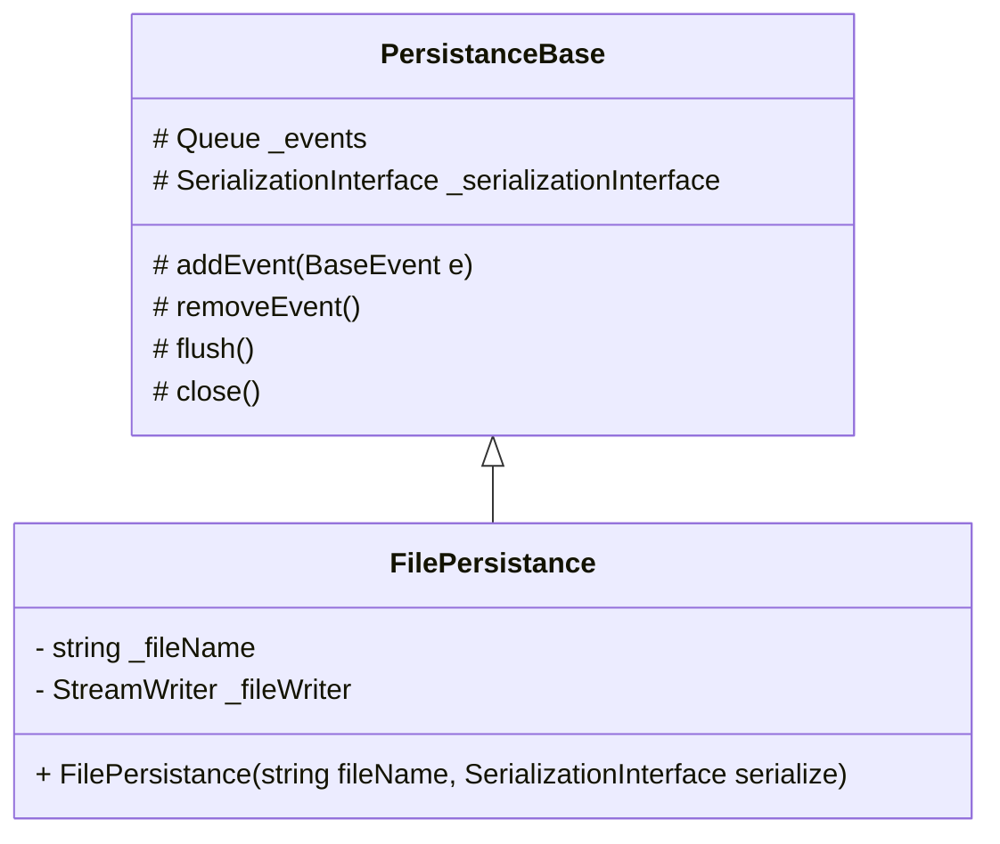

# Documento de implementación

El sistema de telemetría genera una *.dll* que debe incorporarse al proyecto, e internamente está hecho de la siguiente manera:

1. Eventos
2. Serialización
3. Persistencia
4. Tracker
5. Enums

## Eventos

Los eventos representan los datos que se van a recoger para posteriormente analizarlos.

Para desarrollar los eventos se crea una clase base *BaseEvent* que contiene los parámetros necesarios y comunes a todos los eventos, como pueden ser el timestamp (fecha del evento), ID de sesion, ID de usuario,...



## Serialización

Esta parte es la encargada de procesar los datos y guardarlos en el formato deseado ya sea JSON (**JsonSerialize**) o cualquier otro formato que se implemente siguiendo la interfaz **SerializationInterface**.



## Persistencia

Será la encargada de enviar los datos en archivos al disco duro o a un servidor.



## Tracker

Es la clase principal del sistema de telemetría, la cual debe inicializarse nada más empezar el proyecto y cerrarse al terminar.
Será la encargada de añadir los eventos a la cola y es consciente del sistema de serialización y persistencia que se usa, por lo que se le debe informar al inicializarse.


## Enums

Existen distintos enums, aquí se pueden ver todos con sus valores numéricos correspondientes:
```c#
    public enum EventType : UInt32
    {
        SessionStart = 0,
        SessionStop = 1,
        GameStart = 2,
        GameEnd = 3,
        LevelStart = 4,
        LevelEnd = 5,
        Pause = 6,
        Resume = 7,
        //
        Attack = 8,
        EnemyReceive = 9,
        PlayerReceive = 10,
        RoomMove = 11,
    }
    public enum SerializeType : UInt32
    {
        JSON = 0
    }
    public enum PersistanceType : UInt32
    {
        File = 0
    }
    public enum LevelEnum : UInt32
    {
        None = 0,
        Level1=1,
        Level2=2
    }
    public enum LevelEnd : UInt32
    {
        Win=0,
        Loose=1,
        Other=2
    }
    public enum EnemyType : UInt32
    {
        Robot = 0,
        Spider = 1,
        Saw= 2,
        Sewer=3

    }
```